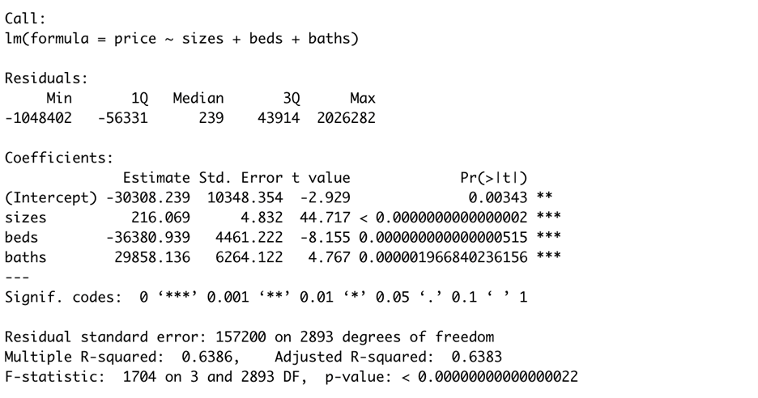

# Stillwater City OK Real Estate
Team Members:
* Chinmayi Rane
* Shujia Huang
* Faisal Jaffri 

*Professor In-Charge* - Dr. Bryan Hammer

## Executive Summary

Real estate is regarded as a physical asset and amazing resource of investment in the modern world. The housing market has always been an important topic for different parties such as the general population, governments at all levels, material suppliers, financial institutions, etc.  Moreover, real estate's excellent return on investment and financial security are two of its main draws for investors. Having said that, investing in an estate is significant and expensive. Given this enormous sum of money, it is imperative to conduct a thorough study before investing in any real estate.

The benefits of real estate analysis are as follows:
* It assists in avoiding bad financial choices.
* It helps investors get an accurate estimate for the appropriate rental property listing.
* Select comparables to find the greatest offers at the lowest rates.
* Study the lowest pricing based on past sales data.
* Determining appropriate value of properties to aid negotiations.

In our study, we'll examine how different aspects of a house's features and the price at which it's sold relate to one another. The objective is to investigate how factors such as area, location, and the number of bedrooms and bathrooms affect price ranges.

## Statement of Scope
### Project Objectives:
 
The scope of this project is limited to scraping data from ‘Zillow’ for the Stillwater city only. The main objectives for our project are listed below:

* *Price Analysis* -  Analyzing the minimum and maximum price range, analyzing the standard deviation based on mean, median and mode of the data and making insights on the price estimations based on the standard deviation

* *Bedroom & Bathroom Analysis* - Identifying the availability and price of the sold houses based on the number bedrooms and bathrooms. Studying what is the average price of the houses available and determining its relation with this number

* *House Area Analysis* -  Identifying the trend which determines the relationship between area and house prices. Using statistical concepts like mean, median, standard deviation kurtosis for this analysis

* *Co-relation Analysis* -  This involves in determining which parameters for the dataset are co-related to the price of the house and also analyzing its percentage of correlation

### Variables:
We have pulled data for sold properties in Stillwater city. The image below shows the page which we used to scrape our data from. 

Our dataset (Stillwater City) for Deliverable 1 contains two files :
* *1.  House.csv ->* This file contains all the important features of the house which we have used for our main analysis. These attributes includes house id, zip code, number of bedrooms, number of bathrooms, area, latitude, longitude, address and the house price.
 
* *2.  House_details.csv ->* This file contains additional details about each house present in the House.csv file. These details include lot area and home type (single family, duplex, Condo etc). These details provide further depth in our analysis. 
 
The target variable here is the price of the house. Our analysis will result in finding attributes that effect the price of the house. For this, we will be finding correlation between variables in our dataset and what variables are positively correlated with the price. We will also predict the house prices by creating a linear regression model that identifies the price of the house with respect to the area. Apart from this, we will also be doing analysis on our target variable with respect to features like bedroom, bathroom, pincode etc. 

For Deliverable 2, we have scraped data for Oklahoma City from realtor.com. On scraping the data we have two files:

* *listings.csv* --> This is the scraped data from realtor.com. This table contains information of price, number of bedrooms, number of bathrooms, house size and address.

*  *realtor.csv* --> This is the cleaned data. It contains price, bedrooms, bathrooms, house size and Zipcode. The attribute Zipcode was derived from address using Regex.

## Unit of Analysis
Our unit of analysis is the house of which we are predicting and analyzing prices. Throughout the project, we see that there are multiple factors that influence our unit (house). These include number of bedrooms, number of bathrooms, house size, zipcode etc. 

## Project Schedule
The overall duration of the project is 14 weeks. The submission is divided into three deliverables:

* Project Proposal: 20 days
* Deliverable 1:  7 weeks
* Deliverable 2: 5 weeks

Microsoft Teams was used to facilitate text-based project discussions. Before the project's first deliverable, we spoke with Dr. Hammer about our project-related thoughts and benefited from his insightful comments. GitHub served as our primary platform for storing code and data.

The following GANTT chart shows the anticipated schedule for our project:

## Data Preparation

For Zillow data:
* This is the final dataset for our project can be found in [placeholder.csv](data/placeholder.csv) 
* The original scrapped data can be found in [scraped_zillow.csv](data/scraped_zillow.csv)
* The code of scrapping data can be found in [zillow_scrape.py](code/zillow_scrape.py)
* The code of cleaned data can be found in [zillow_clean.py](code/zillow_clean.py)

For Realtor data:
* The final scrapped data for our project is [listings.csv](data/listings.csv)
* The cleaned data for our project is [realtor.csv](data/realtor.csv)
* The code of scrapping data can be found in [realtor_scrape.py](code/realtor_scrape.py)
* The code of cleaned data can be found in [realtor_clean.py](code/realtor_clean.py)

### Data Access
There is an ample amount of data present on the internet over real estate. So finding data was not a hard task, but selecting one particular source from all different sources of data took an extra effort. As the scope of the project is limited to one specific area of the state, we tried to find a source that could give us the maximum amount of data. After carefully analyzing different websites and based on the amount of data each website contains, we finalized Zillow as our source.

Zillow is an American technology-based real-estate company that gives customers a flawless experience buying, selling, renting, and financing property all over the United States.

Working with Zillow gave us a breakdown of house types as they have different filters where a user can search houses. For example, a user can search house based on the number of bedrooms, number of bathrooms, living room, area, price, etc. All these small features of the house help us to analyze and correlate different things together and come to amazing conclusions. A normal Home Type in Zillow is divided into:

* All Homes: All homes, i.e, Single Family, Multi family, condo, duplex, etc

* Condo/Co-op

* Multifamily 2+ units

* Duplex/Triplex

Our initial analysis started by scraping data for sold Stillwater houses. There are two ways of to scrape data from Zillow. One is to use Zillow API which fetches data on the basis of house ID and

the other is to scrape the data. The API can only be used if you have a house ID, so we implemented our scripts in such a way that it does two jobs.

* Write a script to fetch the list of houses for a particular search query, for example. We searched for Stillwater, so it gives a list of all houses for the Stillwater location.

* Once we have the list of houses, write a script that fetches the house id from that list and passes it to the API for additional details.

__Scraping Zillow:__ The best way to pull data was from the search page that gives us the list of at least 40 houses along with a pagination view that goes to 20 pages.

As Zillow does not allow a web driver to scrape its pages it barred us from scraping the page using traditional CSS and Xpath selectors. To resolve this issue, we used the Python request module and JSON loads to pull the data from the page. With this approach, we were able to fetch data in JSON format and convert it to a CSV file. We got a bunch of unnecessary parameters which was not required but our script worked, and we got our first set of data.

Our first set of data had more than 15 attributes, and the majority of them were not part of our analysis. Few of the important fields for our analysis includes:

* House ID

* Address

* Zip code

* Number of Bedrooms

* Number of Bathrooms

* Area

* Price

* Latitude

* Longitude

The problem arose when we tried to scrape data for the next page, as we were not using the web driver to scrape our data we were unable to click on the pagination link and move to the next part of the search result.

To solve this approach, we created a loop that ran till the end of the 20 pages and manipulated our search URL in such a way that for every iteration it generates a new updated URL, and send it to our scrape function to pull the data and convert it into a data frame.

By this method, our script created 20 different data frames and finally merged all those into a single data frame and converted it into a CSV file. Through this approach, we got our initial set of data analysis.

__Using API:__ Once we have our final CSV that contains the required attributes we write an algorithm that fetches house ID from each and every row of the CSV file, calls the Zillow API and fetched two additional details:
* House Type
* Lot Area size

### Data Cleaning
The art of extracting meaningful, uncorrupted, or badly formatted data from source data is known as Data Cleaning. It’s one of the most crucial factors of any analysis, if data is not correct, the analysis or the models will return unreliable results. But how do we know that our
data is uncorrupted? There are a few steps that we took to clean data and make it appear more reliable. All the data cleaning is done using Python and with the help of pandas.

* Remove unwanted observations from values: Price is the main factor on which most of our analysis depends. But in our scraped data, the price column comes with a value $ 320,000. Multiple things are wrong with this format, firstly the price is saved as a string value in the scraped file, we need the price as a numeric value so that we can do calculations on it. Secondly, it contains the ‘$’ and ‘,’ signs which we don’t need in our numbers. To deal with it, our script iterated over each value and removed the ‘$’ and ’,’ sign. Finally converted it to a numeric value.

* Identification of null values: Every data has some null values, our data was also not perfect. It too had null values, for e.g few of our important features like the number of bedrooms, the number of bathrooms, the area etc had null values. To search for null values we loaded the CSV file into the data frame and applied ‘df.isna()’ to fetch all the columns that contain null values. Once we got the user name, to deal with features like the number of bedrooms, bathrooms, etc, we inserted 0 in those positions. To columns like a street address, and housing type we inserted a sting as “N/A” in which data is unavailable.

* Data Types: The last step is to convert each column of the data frame to a data type that we need for our calculation. For e.g columns like price, a number of bedrooms, and area are all converted to a numeric value. So it’s easier to apply calculations to them.

### Data Transformation
After removing all the irregularities from our data set we now moved to the data transformation where we made changes to the columns, add more columns etc.

* Separate one column into multiple columns: One of our columns contains latitude and longitude information in one particular column, on top of that in a complicated string “{'latitude': 36.10448, 'longitude': -96.97707}”. For our analysis purpose, we created two different columns of lat & long and extracted only the numeric values into them.

* Convert and rename the columns: At this point, we remove all the unwanted columns from our scraped data which is not part of our analysis. We used the Python drop function to drop all such columns.

### Data Reduction
Remove unwanted columns: If we look at our cleaned and transformed there are a few columns that we don’t require for our final analysis, for instance, there was a column in which only the currency sign was given, it was the '$’ sign, we dropped it. Similarly, we found at least 20 such columns and dropped it from our final datasheet with the help of the panda’s drop columns function.

With this step, we are almost done with 80% of our data transformation and have two clean CSV files.

### Data Consolidation
At this stage, we have two different data files.

* House.csv
* House_details.csv

The first file contains information of roughly 800 sold houses in Stillwater, the latter file contains the id of those houses along with two other additional parameters which are going to be crucial for our analysis.

Now we want common data from both files, which is nothing but the house details from the first file and additional detail of that house from the second file. We got this data by Inner join, as we only need data that matched both files on the basis of the House ID. For joining we just loaded both on a data frame and used the merge functionality of Pandas framework to get the final merged data and converted it to a new CSV file “placeholder.csv”.

After this step, we have our final data which we are going to use for our final analysis.

### Data Dictionary

| Attribute Name | Description | Data Type | Source | Data | Example |
|:---|:---|:---:|:---|:---|:---:|
| zpid | Unique integer identifier for a house | integer | https://www.zillow.com/homedetails/5919-E-15th-Ave-Stillwater-OK-74074/86106640_zpid/ | [placeholder.csv](data/placeholder.csv) | 86106640 |
| detailURrl | Links for a house including all detail features of this house | char(100) | https://www.zillow.com/stillwater-ok/sold/ | [placeholder.csv](data/placeholder.csv) | https://www.zillow.com/homedetails/5919-E-15th-Ave-Stillwater-OK-74074/86106640_zpid/ |
| address(Realtor) | Address for a house | char(50) | https://www.zillow.com/stillwater-ok/sold/ | [placeholder.csv](data/placeholder.csv) | 5919 E 15th Ave, Stillwater, OK 74074 |
| addressStreet(Realtor) | Street line in address for a house | char(30) | https://www.zillow.com/stillwater-ok/sold/ | [placeholder.csv](data/placeholder.csv) | 5919 E 15th Ave |
| Zipcode(Realtor) | 4 digits zipcode in address for a house | integer | https://www.zillow.com/stillwater-ok/sold/ | [placeholder.csv](data/placeholder.csv) | 74074 |
| number of bedrooms(Realtor) | A basic feature related to number of bedrooms for a house | integer | https://www.zillow.com/stillwater-ok/sold/ | [placeholder.csv](data/placeholder.csv) | 8 |
| number of bathrooms(Realtor) | A basic feature related to number of bathrooms for a house | integer | https://www.zillow.com/stillwater-ok/sold/ | [placeholder.csv](data/placeholder.csv) | 4 |
| area(Realtor) | A basic feature related to area for a house, unit is square feet | integer | https://www.zillow.com/stillwater-ok/sold/ | [placeholder.csv](data/placeholder.csv) | 7331 |
| price(Realtor) | The lastest sold price for a house, unit is dollar | integer | https://www.zillow.com/stillwater-ok/sold/ | [placeholder.csv](data/placeholder.csv) | 320000 |
| latitude | Latitude of location for a house | decimal | https://www.zillow.com/stillwater-ok/sold/ | [placeholder.csv](data/placeholder.csv) | 36.10448 |
| longitude | Longitude of location for a house | decimal | https://www.zillow.com/stillwater-ok/sold/ | [placeholder.csv](data/placeholder.csv) | -96.9771 |
| homeType | Type for a house, advice on different families | char(20) | https://www.zillow.com/stillwater-ok/sold/ | [placeholder.csv](data/placeholder.csv) | SINGLE_FAMILY |
| lotsize | The size of the piece of land for a house, unit is square feet | integer | https://www.zillow.com/stillwater-ok/sold/ | [placeholder.csv](data/placeholder.csv) | 87120 |

## Data Visualization
Our Data Visualization module contains analysis based on number of bedrooms and bathrooms, house prices analysis, zipcode analysis. We also try to analyse the correlation of price with zipcode, beds, baths and house-size.

* The R code for data visualization can be found in [realtor_visualization.R](code/realtor_visualization.R)
* The Python code for Histogram and Linear Regression can be found in [histogram_linegraph.py](code/histogram_linegraph.py)

#### House Price Analysis
Our dataset contains information about the area of the house, location, number of bedrooms, number of bathrooms, and zip code. Our goal is to build up a regression model which gives us the price based on these features. A regression model defines the relationship between dependent variable and two or more independent variables. Here, the dependent variable is the price. But before building the regression model, we must first identify our independent variables which correlate to the price. There are different ways by which we can see the correlation among our variables, we can use scatter plots, correlation matrices, pairwise correlation, etc. We will be using all these methodologies later in our analysis. 

#### Bedroom Analysis
As our dataset has houses with different numbers of bedrooms, it would be interesting to see which are the most common house where people live according to our dataset.

From the bar graph above, we can see the distribution is rightly skewed which means that it has a long right tail and peak lies on the left side. It’s clear evidence from our dataset that the maximum number of houses contains 3 bedrooms, followed by 4 and 5. 
We can also see that there are few houses with 6, 7 and 8 bedrooms. 

Let’s look at the number of bedrooms with an average price. We could see that the house with 53 Beds has the highest avg. price followed by the house with 24 beds. But these values also seem to be outliers, but as of now, we don’t know whether these are influential outliers or not. Also, we can see that the maximum average price is for 5 Bedrooms.

#### Bathroom Analysis

We can see the distribution is rightly skewed which means that it has a long right tail and peak lies on the left side. It’s clear evidence from our dataset that the maximum number of houses contains 2 bedrooms, followed by 2.5 and 3.5. 
We can also see few outliers in our data set which we will take care of later when we prepare our regression model.

We can see that as the number of bathrooms increases the price also increases. It has a linear relationship. 

#### Linearity/Nonlinearity of relationships between Predictors and Dependent variable. 

The 4 independent variables or predictors present in our model are the number of bathrooms, number of bedrooms, Zip code, and size of the house. Our dependent variable is Price. Now we will check if the relationships between these independent variables and dependent variables are linear or not.

#### Size vs. Price

It seems like a linear trend in Price vs Size, as the size or the area of the house increases the price increases as well. We can see an outlier as well.  We can see two outliers as well; we can further analyze these outliers that whether they are just extreme values or extremely influential which need to be omitted or kept. But for the sake of simplicity, we will get rid of those values as they are only two values.

#### Bath vs. Price

The number of bathrooms shows a somewhat linear relationship with the price of the house. We can see an outlier as well. There is less spread between a lower number of bathrooms.

#### Beds vs. Price

The number of beds shows a distinct nonlinear relationship, we can also see an extreme value of more than 50 beds. 

#### Zipcode vs. Price

There seems to be no relationship between the zip code and the price of the house. 

#### Log Transform Number of Bedrooms and Bathrooms

As with the scatter plot, we did not get a clear picture of our relationship between beds and baths due to skewness, we now transform beds and baths using log functions.

Now both the plots for beds and baths against price show a better linear relationship. 

#### Correlation Matrices

Correlation measures the strength of the linear relationship between two variables, below we can see a correlation heatmap for our dataset. The closer its value is to 1 or -1 we have a strong linear relationship.

#### Correlation after Log Transformation

It is clearly visible that after log transformation values of baths and beds, we see an increase in the correlation coefficient.

#### Simple Linear Regression
With this, we have a good understanding of the predictors which are important to our model and which will be helpful for us to create a prediction mode for house prices. Since the size or area of the house has the highest collinearity, let us build a simple regression model for predicting the house price by feeding size into it.

 
We can see a plot of price bs sizes with our regression line. The linear regression tries to find the best line to predict the price of the house on the basis of the size or area of the house. Lets us closely look at our prediction equation:

***Predicted House Price = -82243.21 + 214.95 x size***

The intercept is negative, it basically means that when the size of the house is 0 the price is negative. It just says that we don’t have any 0 house sizes.

The beta coefficient for the size, also known as the slope, is *214.95*.

#### Interpretation
It means that with a unit increase in the size of the house the price of the house increases by $214.95. 

Before predicting the price of the new houses by area let us see that the model is statistically significant. The summary of the model can be seen in the above image:

To test the significance, we must perform the Hypothesis test which is as follows:
* Null hypothesis (H0): No relationship between size and price	
* Alternative Hypothesis (Ha): there is some relationship between size and price

#### Model Fit

The R2 for the model is 0.6346, It means that the size of the house explains 63.4% of the variability in the Price of the House. 

#### p-value
We can see that the p-value is close to 0 so we reject the Null Hypothesis that there is no relationship between size and price at alpha = 0.05

We conclude (at alpha = 0.05) that there is a significant linear relationship between the size and price of the house. For each unit increase in size, the price of the house goes up by $214.95.

The table below shows depicts the price predicted by our model. Considering the first instance, we can see that the actual price is $31,3383 and the predicted price is $38,6918. This shows that our project has predicted the prices with a good accuracy. 

### Multiple Linear Regression (Multiple Predictors: Size, Baths, Beds)

### The model:

*Predicted House Price(price) = -30308.239 + 216.069 x sizes – 36380.939 x beds + 29858 x baths*

A unit increase in the size of the house increases the price of a house by $216.069 controlling for (or holding constant) the value of beds and baths in the model.

### Interpretation of Betas:

Since the p-values for all the predictors (H0 : βsizes | H0 : βbeds | H0 : βbaths )are 0, we reject the null hypothesis at alpha = 0.05
We conclude that:
*	size is a significant predictor of price when beds and baths are included in the model.
*	bed is a significant predictor of price when sizes and baths are included in the model.
*	baths is a significant predictor of price when sizes and baths are included in the model.

### Model Fit F Test:

Null Hypothesis: H0: βsizes = βbeds = βbaths = 0
Alternate Hypothesis Ha: βsizes, βbeds , βbaths != 0

F statistic:
* 	1704 with numerator 3 degrees of freedom and denominator 2893 degree of freedom
	* K = 3 is the number of predictors and 2897 the sample size. 
The p-value for the statistic is 0.000

### Model Conclusion

As we can see that at least one of the βsizes, βbeds , βbaths != 0, i.e. at least one of the three predictors Sizes, Beds, and Baths is useful in predicting prices.

### Model 1 vs Model 2

Both our Linear Regression Model and Multiple Regression Model are almost the same with both representing a good fit for our price prediction model. So, we can use any of the models for predicting the price.

With model 1, We take the size of the house as 1295 sqft and predict its price as $196112.3. But we don’t have any control over other predictors. 

With model 2, We take the same size of the house as 1295 sqft and include 3 bedrooms and 2 bathrooms. After this, we run our model. Our model predicts the price as $250554.4. But now we have control over a number of bedrooms and bathrooms as well.

## Conclusion and Discussion
##### Summary of the findings

* For the project deliverable 1, we have successfully scraped data from Zillow. Apart from being a dynamic website, Zillow had a strong firewall which was immuned to web scrapping data from it. So initially, we weren’t able to use geckodriver to scrape the data. Instead, we used the Python request module and scrapped the data with the help of json loads framework.
 
* At first, we had scraped data into two csv files namely House.csv and House_details.csv. 
 
* The House_details.csv file contains detailed information about every house instance collected in House.csv file. This process involved navigating to each house’s individual page and scrapping data from there. We used Zillow API for this process.
 
* We then merged and consolidated these two files based on the attribute house id. Our final dataset is a combination of major attributes from House.csv and detailed attributes about each specific house from the House_details.csv files.

* For Deliverable 2, we scrapped data from Realtor website and performed the entire data preparation just like Zillow. All our analyses and model development is based on realtor data.

* Bedroom and Bathroom Analysis:  According to our analysis we saw that houses with 3 bedrooms and houses with 2 bathrooms are the most commonly sold houses. So any real estate developer can use this analysis and build houses with these features to get maximum profit.

* Our Price prediction models can help many companies, and individuals estimate the price of the house by area, the number of bedrooms, and the number of bathrooms. Companies can forecast and predict the price of the houses in that area to attract potential customers who are interested in buying a house in the future.

##### What are the implications of your research upon the people, businesses, or community related to the project?

Our research would aid its users in the following ways:
* Analyzing the prices of houses based on area, number of bedrooms, number of bathrooms, zipcode etc
* Determining correlation between different variables of house including area, bedrooms, bathrooms, zipcode etc.
* Predicting the price of the house based on its area for a specific location (in this case: Oklahoma City)
* This analysis can help real-estate developers build houses with these features to get maximum profit.
* Property Evaluations

